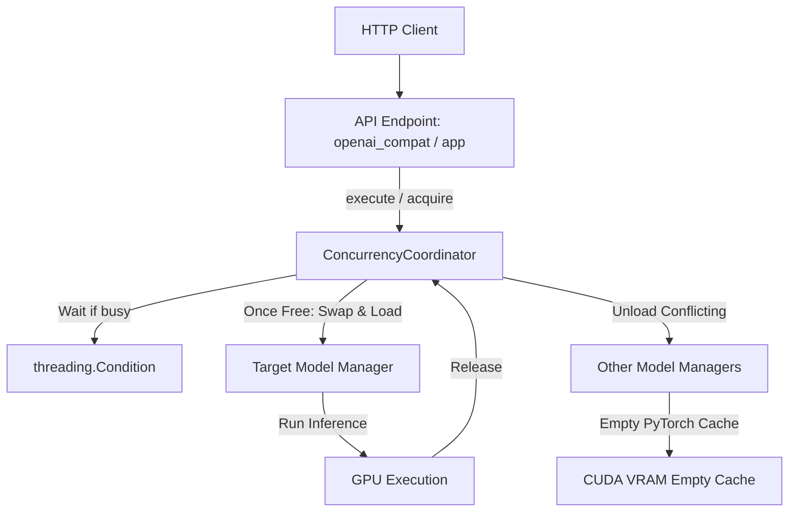

# VRAM Concurrency Coordination and Serialization Design

This document details the architecture, design decisions, and implementation details of the VRAM Concurrency Coordinator in LAAS (Local AI API Stack).

## 1. Overview & Motivation

Local LLMs (e.g., Gemma-4-it) and Image Generation models (e.g., SDXL Turbo, SD 1.5 edit/inpainting) are heavy GPU-bound resources. In typical developer environments, local GPUs have limited VRAM (e.g., 6GB to 16GB). 

Attempting to run these models concurrently or load them simultaneously can cause:
1. **CUDA Out-of-Memory (OOM) Errors**: GPU allocations exceed available hardware VRAM, crashing the server.
2. **KV Cache Corruption**: In `llama-cpp-python`, concurrent inference operations on the same loaded model without thread-safe orchestration can corrupt the key-value context cache.
3. **Severe Thrashing**: Models continuously swapping back and forth between system RAM/swap and VRAM, leading to extremely high latency.

To address this, LAAS features a centralized, thread-safe serialization layer, **`ConcurrencyCoordinator`**, to coordinate GPU access, swap models safely, and serialize request queues globally.

---

## 2. Architecture & Design Decisions



### Global Model Serialization
Instead of allowing concurrent execution on loaded GPU models, **all** heavy resource operations are globally serialized:
- Chat completions, completions, and responses (`"llm"`)
- Image generation and variation (`"image"`)
- Image editing and inpainting (`"image_edit"`)

If a request for a model type is running, any concurrent requests (even for the *same* model type) will block and queue up in the coordinator.

### Exemption for Lightweight CPU Models
Lightweight, CPU-bound models do not require strict VRAM serialization. They bypass the coordinator entirely and can be accessed concurrently:
- **Kokoro TTS** (Text-to-Speech)
- **Whisper STT** (Speech-to-Text)
- **Embeddings** (typically light/fast)

---

## 3. Concurrency Coordinator Implementation

The coordinator is defined in [src/laas/concurrency.py](../src/laas/concurrency.py) as `ConcurrencyCoordinator`.

### Key Components
1. **Active Job Registry (`self.active_jobs`)**: Maps each heavy resource type to the count of currently active jobs.
2. **Global Serialization Lock (`self.lock`)**: A `threading.Lock` protecting the coordinator's state.
3. **Condition Variable (`self.condition`)**: Used to suspend and resume threads waiting for GPU resource allocation.
4. **VRAM Cleansing & Cache Flush**: When swapping resource types (e.g., from `"llm"` to `"image"`), the coordinator:
   - Unloads the conflicting model manager.
   - Triggers `gc.collect()`.
   - Clears the PyTorch CUDA cache (`torch.cuda.empty_cache()`) to ensure the GPU memory is actually freed for the incoming model.

### Honor `download_if_missing` Settings
When auto-loading models during coordination acquisition, the coordinator checks and honors the individual manager's configurations:
* `"llm"` checks `manager.settings.auto_download`
* `"image"` checks `manager.settings.image_auto_download`
* `"image_edit"` checks `manager.settings.image_edit_auto_download`

If auto-download is disabled and the model is missing locally, it immediately raises a `ModelNotDownloadedError` / `ImageNotDownloadedError` instead of attempting an unauthorized Hugging Face download.

---

## 4. Endpoints & Request Lifecycles

### Streaming Responses (Server-Sent Events)
For streaming completions (`stream=True`), the coordinator holds the active resource lease throughout the entire lifecycle of the server-sent events stream, releasing it only when the stream exhausts or the client disconnects.

This is implemented using generator stream wrapping:
```python
def wrap_stream(self, resource: HeavyResourceType, generator: Iterable[Any]) -> Iterable[Any]:
    try:
        for chunk in generator:
            yield chunk
    finally:
        self.release(resource)
```

### Manual Lifecycle Integration
Endpoints that trigger model loading or unloading manually (e.g., `/v1/local/models/load` or `/v1/local/models/unload`) enter a coordinator maintenance window. Maintenance waits for active heavy-model requests to drain before loading, unloading, or swapping resources.

### Runtime Status
Use `GET /v1/local/concurrency/status` to inspect the coordinator while the
server is running. The response includes:

- `active_resource`: the heavy resource currently holding the coordinator lease.
- `active_jobs`: active job counts for `llm`, `image`, and `image_edit`.
- `total_active_jobs`: total heavy jobs currently running.
- `registered_resources`: heavy resources known to the coordinator.
- `resources`: per-resource registered, loaded, manager, and active-job state.

PowerShell:

```powershell
Invoke-RestMethod -Uri http://127.0.0.1:8000/v1/local/concurrency/status
```

---

## 5. Verification and Testing

Integration tests verifying the concurrency layer are located in [tests/test_concurrency.py](../tests/test_concurrency.py).

To execute the concurrency test suite:
```powershell
.\.venv\Scripts\python.exe -m pytest tests/test_concurrency.py
```

To run a live smoke against a running server:

```powershell
.\.venv\Scripts\python.exe scripts\concurrency_smoke.py --include-image-edit
```
